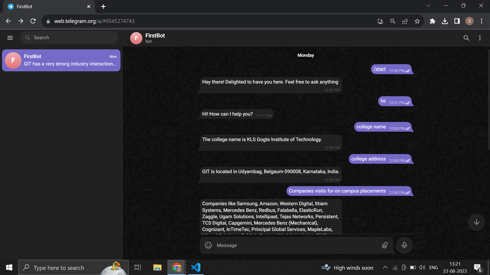

# Py-Telegram-Bot
It's a telegram chatbot by using which you can chat with your pdf files using Similarity Search. This project uses LLM and Langchain to build this chat bot.

# HOW TO USE
1. Get your own telegram bot token and open ai token
1. ADD you own open AI token and telegram bot token in main.py and  lib/chat.py
2. In telebot_model.ipynb add your openai API KEY and file path for your pdf
3. Run the all cells from telebot_model.ipynb it generates a vector_store in folder in lib folder
4. Run the main.py file and open your telegram chatbot and test

# UI SCREEN SHOT
